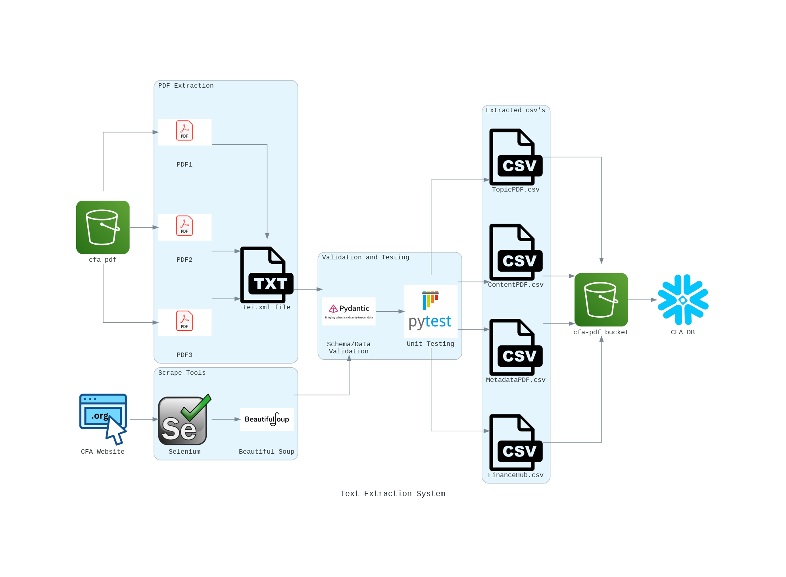
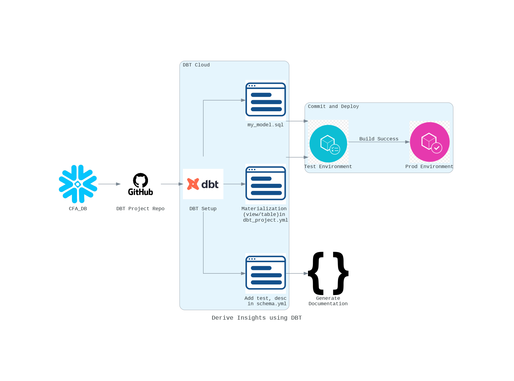

## Big Data Systems and Intelligence Analytics (DAMG 7245)

| Name         | Email                        | NUID    |
| ------------ | ---------------------------- | ------- |
| Ameya Apte   | apte.ame@northeastern.edu    | 2764540 |
| Sayali Dalvi | dalvi.sa@northeastern.edu    | 2799803 |
| Soeb Hussain | hussain.soe@northeastern.edu | 2747200 |

# Assignment 3

# Finance Institute Related Database Development

Big Data Systems and Intelligence Analytics (DAMG 7245)

## Overview

This project aims to aggregate and make accessible finance institute related materials through a comprehensive data engineering solution. It involves creating datasets from materials listed on the CFA Institute’s website, structuring the data, extracting text from PDF files, and using DBT to perform data transformation.

## Live application Links

[](https://codelabs-preview.appspot.com/?file_id=13MgE1pIwI1kbKHhhZf0IjBEvPTK-F1nJS3qvQEnQ76U)

## Problem Statement

### Part 1:

- Create Python classes and implement schema/data validation using Pydantic.
- Following are the required classes
  - `URLClass`: to represent the schema for the CFA webpages (224 pages)
  - `MetaDataClass` and `ContentPDFClass` to represent Grobid extracted metadata and content respectively from the 3 pdf files
- Use Pytest for each of the three classes to show how your validation would succeed/fail (5 pass and 5 fail)
- Generate csv data from these classes and upload the same to s3 bucket
- Load data into snowflake tables from s3 bucket

### Part 2:

- Use DBT with Snowflake to run transformation workflows.
- Review [DBT Documentation](https://docs.getdbt.com/docs/introduction) to understand DBT
- Implement following steps [DBT Snowflake Documentation](https://docs.getdbt.com/guides/snowflake?step=7) on the data stored in snowflake tables

### Requirements:

- Load the clean data into Snowflake
- Create Test and Production DB/Tables in Snowflake
- You intend to create a summary table with the following schema using DBT - Level, Topic, Year, Number of articles, Min Length (Summary), Max Length (Summary), Min Length (Learning outcomes), Max Length (Learning outcomes)
- Build a DBT model
- Materialize model to a new table
- Write tests to validate the new columns
- Document the model
- Commit and Deploy the model

## Features

- **Data Extraction**: Utilizes web scraping to gather finance-related materials.
- **Data Structuring**: Organizes scraped data into a coherent structure suitable for database integration.
- **Text Extraction**: Implements algorithms to extract text from PDF documents.
- **Cloud Integration**: Utilizes AWS S3 for storage and Snowflake for database management.
- **Schema Validation**: Utilizes Pydantic for schema/data validation
- **Unit Testing**: Utilizes Pytest for testing

## Architecture Diagram




## Technologies Used

[](https://github.com/)
[](https://www.python.org/)
[](https://pypi.org/project/beautifulsoup4/)
[](https://www.selenium.dev/)
[](https://grobid.readthedocs.io/en/latest/Introduction/)
[](https://cloud.getdbt.com/)
[](https://www.snowflake.com/en/)
[](https://aws.amazon.com/s3/)
[](https://aws.amazon.com/s3/)
[](https://aws.amazon.com/s3/)

- Python for scripting and web scraping
- Jupyter Notebook for data analysis and visualization
- Snowflake for data storage and management
- AWS S3 for cloud-based file storage
- Pydantic for Data/Schema Validation
- Pytest for testing
- DBT Cloud for data transformation

## Data Sources

- [S3 Bucket](https://cfa-pdfs.s3.us-east-2.amazonaws.com/)
- [Finance Website](https://www.cfainstitute.org/en/membership/professional-development/refresher-readings#sort=%40refreadingcurriculumyear%20descending)

## Pre requisites

No specific prerequisites are required. Only installation of required packages needs to be done

## Project Structure

```
├─ .gitignore
├─ LICENSE
├─ README.md
├─ config.json
├─ dbt
│  ├─ analyses
│  │  └─ .gitkeep
│  ├─ dbt_project.yml
│  ├─ macros
│  │  └─ .gitkeep
│  ├─ models
│  │  ├─ cfa_model.sql
│  │  ├─ schema.yml
│  │  ├─ sources.yml
│  │  ├─ stg_learning_outcomes.sql
│  │  ├─ stg_summary.sql
│  │  └─ stg_urldata.sql
│  ├─ seeds
│  │  └─ .gitkeep
│  └─ snapshots
│     └─ .gitkeep
├─ diagram
│  └─ Diagrams.ipynb
├─ grobid_client_python
├─ images
│  ├─ 2.png
│  ├─ 3.png
│  ├─ 4.png
│  ├─ API.png
│  ├─ architecture.png
│  ├─ brackets-coding-icon.png
│  ├─ csv-file-icon.png
│  ├─ dbt.jpg
│  ├─ dbt_Architecture.png
│  ├─ github.png
│  ├─ prod.png
│  ├─ pydantic.jpeg
│  ├─ pypdf.png
│  ├─ pytest.jpeg
│  ├─ selenium.png
│  ├─ soup.png
│  ├─ test.png
│  └─ txt-file-icon.png
├─ models
│  ├─ content_pdf.py
│  ├─ metadata.py
│  ├─ topic_pdf.py
│  └─ urlClass.py
├─ output_data
│  ├─ cleaned_csv
│  │  ├─ 224_links.txt
│  │  ├─ ContentPDF.csv
│  │  ├─ FinanceHub.csv
│  │  ├─ MetadataPDF.csv
│  │  └─ TopicPDF.csv
│  └─ grobid
│     ├─ 2024-l1-topics-combined-2.grobid.tei.xml
│     ├─ 2024-l2-topics-combined-2.grobid.tei.xml
│     └─ 2024-l3-topics-combined-2.grobid.tei.xml
├─ scripts
│  ├─ driver.py
│  ├─ parse_grobid_xml.py
│  ├─ snowflake_setup.py
│  ├─ utility.py
│  └─ web_scaping_url_dataset_creation.py
└─ tests
   ├─ test_content.py
   ├─ test_metadata.py
   ├─ test_topic.py
   └─ test_urlClass.py
```

_You can generate the project tree using following tools_

- _[Project Tree Generator](https://woochanleee.github.io/project-tree-generator)_

- _[Generate from terminal](https://www.geeksforgeeks.org/tree-command-unixlinux/)_

## How to run Application locally

### Setup and Installation

1. Clone the repository to your local machine.
2. Configure AWS S3 and Snowflake with the provided setup guide.
3. Install selenium webdriver for edge browser - Download the edge webdriver file and set the Path in environment variables
4. Configure repository on github with DBT cloud account and connect the snowflake environment with DBT to access the required tables.
5. Tables:
   - metadata: METADATA
   - web scraped data: URLDATA
   - contents: CONTENTS
   - topic: TOPICS

## References

- [S3 Documentation](https://docs.aws.amazon.com/s3/?icmpid=docs_homepage_featuredsvcs)
- [Snowflake Documentation](https://docs.snowflake.com/en/)
- [Grobid Documentation](https://grobid.readthedocs.io/en/latest/Introduction/)
- [CFA Institute's Website](https://www.cfainstitute.org/en/membership/professional-development/refresher-readings#sort=%40refreadingcurriculumyear%20descending)
- [CFA Institute's Website](https://www.cfainstitute.org/en/membership/professional-development/refresher-readings#sort=%40refreadingcurriculumyear%20descending)
- [Pydantic Documentation](https://docs.pydantic.dev/latest/)
- [Pytest Documentation](https://docs.pytest.org/en/7.1.x/contents.html)
- [DBT Documentation](https://docs.getdbt.com/docs/collaborate/documentation)
- [DBT Snowflake Documentation](https://docs.getdbt.com/guides/snowflake)
